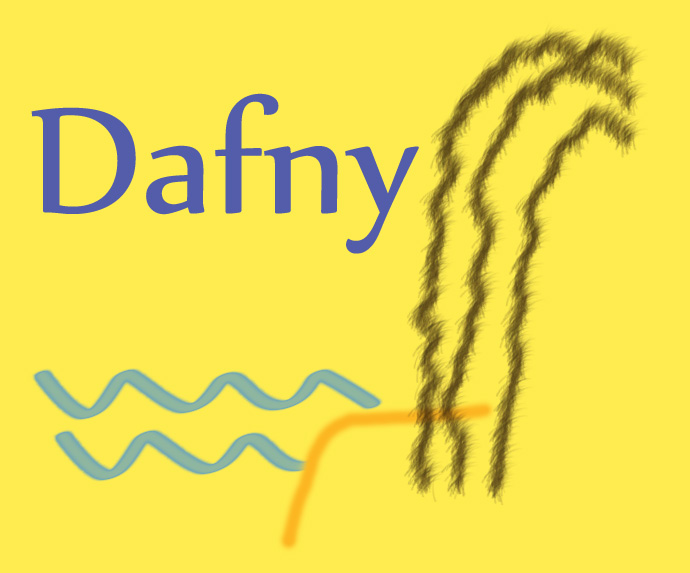

# Dafny Resources [↩](README.md#top)

<table style="font-family:Helvetica,Arial;line-height:1.6;">
  <tr>
  <td style="border:0;padding:0 10px 0 0;;min-width:120px;"></td>
  <td style="border:0;padding:0;vertical-align:text-top;">This document gathers <a href="https://dafny.org/" rel="external">Dafny</a> related resources that caught our attention.
  </td>
  </tr>
</table>

## Articles

- [Accessible Software Verification with Dafny][article_leino] by K. Rustan M. Leino, December 2017.

## Blogs [**&#x25B4;**](#top)

- [Getting started with Dafny: Your first formal proof](https://www.linkedin.com/pulse/getting-started-dafny-your-first-formal-proof-alfred-white-puucc) by Alfred White, May 2024.
- [It is just a Formality...]() by Alfred White, January 2024.
- [Nine Rules to Formally Validate Rust Algorithms with Dafny (Part 2)](https://towardsdatascience.com/nine-rules-to-formally-validate-rust-algorithms-with-dafny-part-2-f2a279686700) by Carl M. Kaddie, Octobre 2023.
- [Nine Rules to Formally Validate Rust Algorithms with Dafny (Part 1)](https://towardsdatascience.com/nine-rules-to-formally-validate-rust-algorithms-with-dafny-part-1-5cb8c8a0bb92) by Carl M. Kaddie, October 2023.
- [How To Get Your Verified Dafny Program To Interact With External Code][blog_mijail] by Horacio Mijail, June 2022.
- [Re-Proving the Coding Interview](https://www.cs.utexas.edu/~ntaylor/blog/proving-3/) by Nathan Taylor, April 2022.
- [Proving the Coding Interview II](https://www.cs.utexas.edu/~ntaylor/blog/proving-2/) by Nathan Taylor, April 2022.
- [Proving the Coding Interview](https://www.cs.utexas.edu/~ntaylor/blog/proving/) by Nathan Taylor, April 2022.

## Books [**&#x25B4;**](#top)

- [Program Proofs](https://mitpress.mit.edu/9780262546232/program-proofs/) by K. Rustan and M. Leino, Martch 2023. (MIT Press, ISBN 978-0-262546232, 496 pages)
- [Introducing Software Verification with Dafny Language](https://www.amazon.com/Introducing-Software-Verification-Dafny-Language/dp/1484279778) by Boro Sitnikovski, March 2022. (Apress, ISBN 978-1-484279779, 152 pages)

## Conferences

- [Dafny 2025](https://popl25.sigplan.org/home/dafny-2025), Denver, 29-25 January 2025.
- [Dafny 2024](https://popl24.sigplan.org/home/dafny-2024), London, 17-19 January 2024.

## Papers

- [A formal foundation for the Dafny verifier]()

## Tools

- [Dafny VSCode](https://github.com/dafny-lang/ide-vscode) &ndash; VSCode IDE Integration for [Dafny]. 

## Videos

- [Dafny, the Programming Language With Built In Formal Verification (Part 1)](https://www.youtube.com/watch?v=rxdYV-woRDo) by Jackson Kelley, October 2020.
- [Formal Verification using Dafny - Part 2](https://www.youtube.com/watch?v=tBNV5LoXlDY) by DG, June 2020.
- [Formal Verification using Dafny - Part 1](https://www.youtube.com/watch?v=k9fwDxZP-0Y) by DG, June 2020.

***

*[mics](https://lampwww.epfl.ch/~michelou/)/December 2024* [**&#9650;**](#top)
&nbsp;

<!-- href links -->

[article_leino]: https://www.computer.org/csdl/magazine/so/2017/06/mso2017060094/13rRUxC0SCh
[blog_mijail]: https://consensys.io/blog/how-to-get-your-verified-dafny-program-to-interact-with-external-code
[dafny]: https://
