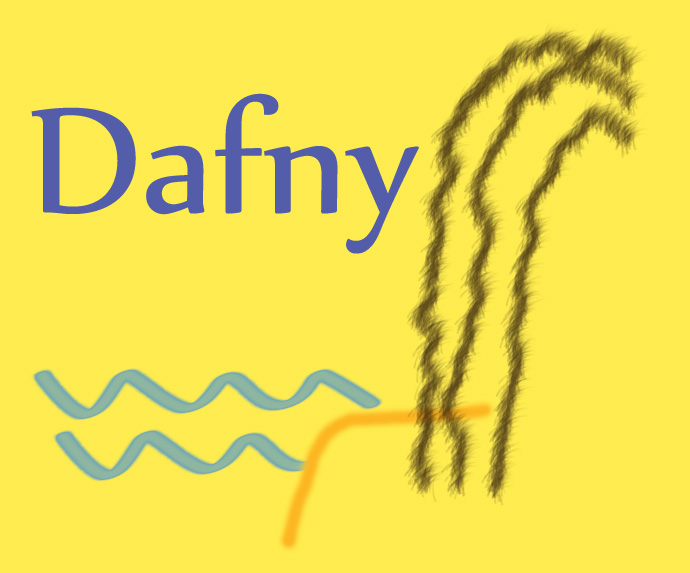

# Dafny Examples [⬆](../README.md#top)

<table style="font-family:Helvetica,Arial;line-height:1.6;">
  <tr>
  <td style="border:0;padding:0 10px 0 0;min-width:25%;"></td>
  <td style="border:0;padding:0;vertical-align:text-top;">Directory <a href="."><strong><code>examples\</code></strong></a> contains <a href="https://dafny.org/" rel="external" title="Dafny">Dafny</a> code examples coming from various websites - mostly from the <a href="https://dafny.org/" rel="external" title="Dafny">Dafny</a> project. 
  It also includes build scripts (<a href="https://tldp.org/LDP/Bash-Beginners-Guide/html/sect_02_01.html" rel="external">Bash scripts</a>, <a href="https://en.wikibooks.org/wiki/Windows_Batch_Scripting" rel="external">batch files</a>, <a href="https://makefiletutorial.com/" rel="external">Make scripts</a>) for experimenting with <a href="https://dafny.org/" rel="external">Dafny</a> on a Windows machine.</td>
  </tr>
</table>

## Fibonacci

This example has the following directory structure :

<pre style="font-size:80%;">
<b>&gt; <a hfef="">tree</a> /f /a . | <a href="">findstr</a> /v /b [A-Z]</b>
|   <a href="./Fibonacci/build.bat">build.bat</a>
|   <a href="./Fibonacci/build.sh">build.sh</a>
\---<b>src</b>
        <a href="./Fibonacci/src/Fib.dfy">Fib.dfy</a>
</pre>

Command [**`build.bat`**](./Fibonacci/build.bat)`-verbose clean run` [1](#footnote_01) generates and executes the [Dafny] program `target\Fib.exe` :

<pre style="font-size:80%;">
<b>&gt; <a href="./Fibonacci/build.bat">build</a> -verbose clean run</b>
Delete directory "target"
Build Dafny program "target\Fib.exe"

Dafny program verifier finished with 3 verified, 0 errors
Execute Dafny program "target\Fib.exe"
fib(10)=55
</pre>

> **Note**: The Dafny command can generate several targets besides the native executable presented above. Command option `--target <name>` 
> |  Name  | Target&nbsp;language | `PATH`&nbsp;at build time |
> |:-------|:-----------|:------------|
> | `cs`   | C#         | |
> | `js`   | JavaScript | |
> | `go`   | Go         | + `%GOROOT%\bin;%GOBIN%` [2](#footnote_02) |
> | `java` | Java       | + `%JAVA_HOME%\bin` |
> | `py`   | Python     | |
> | `cpp`  | C++        | |
> | `lib`  | Dafny Library (.doo) | |
> | `rs`   | Rust    | |
> | `dfy`  | ResolvedDesugaredExecutableDafny | |
>
> For instance, we generate the file `target\Fib.jar` when targetting Java :
> <pre style="font-size:80%;">
> &gt; <a href="./Fibonacci/build.bat">build</a> -debug -target:java clean run</b>
> [build] Options    : _TARGET=java _VERBOSE=0
> [build] Subcommands:  clean compile run
> [build] Variables  : "DAFNY_HOME=C:\opt\dafny"
> [build] Variables  : "GIT_HOME=C:\opt\Git"
> [build] Variables  : "JAVA_HOME=C:\opt\jdk-temurin-17.0.10_7"
> [build] rmdir /s /q "F:\examples\Fibonacci\target"
> [build] "%DAFNY_HOME%\dafny.exe" build --target java --output  "F:\examples\Fibonacci\target\Fib.jar"  "F:\examples\Fibonacci\src\Fib.dfy"
> Dafny program verifier finished with 3 verified, 0 errors
> [build] "%JAVA_HOME%\bin\java.exe" -jar "F:\examples\Fibonacci\target\Fib.jar"
> fib(10)=55
> [build] _EXITCODE=0
> </pre>

<!--================================================================-->
## GettingStarted

This example has the following directory structure :

<pre style="font-size:80%;">
<b>&gt; <a href="">tree</a> /f /a . | <a href="">findstr</a> /v /b [A-Z]</b>
|   <a href="./GettingStarted/00download.txt">00download.txt</a>
|   <a href="./GettingStarted/build.bat">build.bat</a>
|   <a href="./GettingStarted/build.sh">build.sh</a>
\---<b>src</b>
        <a href="./GettingStarted/src/GettingStarted.dfy">GettingStarted.dfy</a>
</pre>

Command [**`build.bat`**](./GettingStarted/build.bat)`-verbose clean run` generates and executes the [Dafny] program `target\GettingStarted.exe`:

<pre style="font-size:80%;">
<b>&gt; <a href="./GettingStarted/build.bat">build</a> -verbose clean run</b>
Delete directory "target"
Build Dafny program "target\GettingStarted.exe"

Dafny program verifier finished with 2 verified, 0 errors
Execute Dafny program "target\GettingStarted.exe"
GettingStarted: Abs(-3)=3
</pre>

<!--=======================================================================-->

## Footnotes [**&#x25B4;**](#top)

[1] ***Missing .NET Framework 6*** [↩](#anchor_01)

<dl><dd>
<pre style="font-size:80%;">
<b>&gt; c:\opt\dafny\Dafny.exe run src\Fib.dfy</b>
&nbsp;
Dafny program verifier finished with 3 verified, 0 errors
It was not possible to find any compatible framework version
The framework 'Microsoft.NETCore.App', version '6.0.0' was not found.
  - The following frameworks were found:
      2.1.12 at [C:\Program Files\dotnet\shared\Microsoft.NETCore.App]
      2.1.13 at [C:\Program Files\dotnet\shared\Microsoft.NETCore.App]
      2.1.26 at [C:\Program Files\dotnet\shared\Microsoft.NETCore.App]
      2.1.30 at [C:\Program Files\dotnet\shared\Microsoft.NETCore.App]
      3.1.32 at [C:\Program Files\dotnet\shared\Microsoft.NETCore.App]
      5.0.17 at [C:\Program Files\dotnet\shared\Microsoft.NETCore.App]
&nbsp;
You can resolve the problem by installing the specified framework and/or SDK.
&nbsp;
The specified framework can be found at:
  - https://aka.ms/dotnet-core-applaunch?framework=Microsoft.NETCore.App&framework_version=6.0.0&arch=x64&rid=win10-x64
</pre>
</dd></dl>

[2] ***Missing* <code>goimports</code> *command*** [↩](#anchor_02)

<dl><dd>
<pre style="font-size:80%;">
<b>&gt; where go</b>
C:\opt\go\bin\go.exe
&nbsp;
<b>&gt; go install golang.org/x/tools/cmd/goimports@latest</b>
go: downloading golang.org/x/tools v0.26.0
go: downloading golang.org/x/mod v0.21.0
go: downloading golang.org/x/sync v0.8.0
</pre>
</dd></dl>

***

*[mics](https://lampwww.epfl.ch/~michelou/)/January 2025* [**&#9650;**](#top)
&nbsp;

<!-- link refs -->

[dafny]: https://dafny.org/
